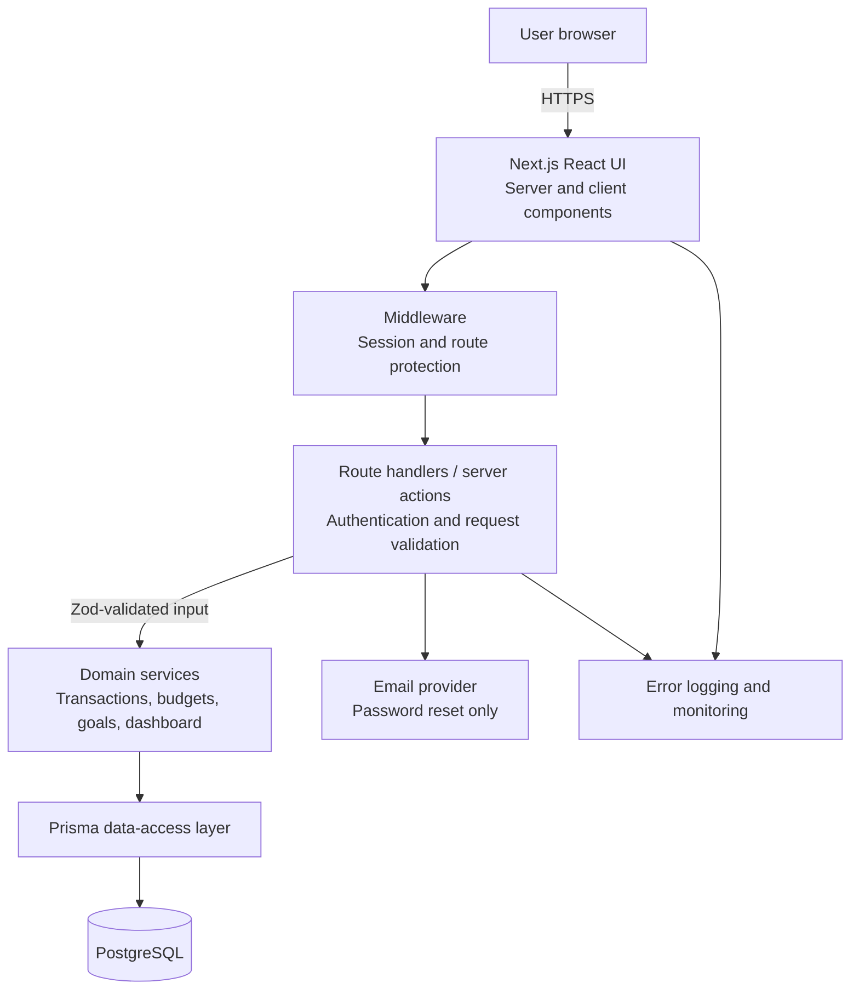

# BudgetWise — Phase 2: System Architecture and Design

## 1. Architecture decision summary

BudgetWise will use a modular monolith: a single TypeScript web application that contains the responsive frontend, authenticated server endpoints, and domain services, backed by PostgreSQL. This is the right starting point for a portfolio-scale MVP because it keeps deployment and security boundaries understandable while preserving clear separation between UI, API, business logic, and persistence.

The proposed stack is:

| Layer | Technology | Rationale |
| --- | --- | --- |
| Web application | Next.js (App Router) with TypeScript | Provides server rendering, routing, server endpoints, and a mature production deployment model in one type-safe project. |
| UI | React, Tailwind CSS, accessible headless UI primitives where needed | Supports reusable components, responsive design, and deliberate accessibility without a large component framework. |
| Validation | Zod | Shares explicit schemas across form and server boundaries, reducing invalid input and type mismatch risk. |
| Database | PostgreSQL | Reliable relational data, transactions, constraints, and indexing are well suited to personal-finance records. |
| ORM | Prisma | Type-safe database access, migrations, and clear schema documentation for a student portfolio. |
| Authentication | Auth.js with credential-based sign-in, bcrypt/Argon2 password hashing, and database-backed sessions | Keeps identity flows integrated with Next.js and enables secure session revocation. Final provider and hashing implementation will be confirmed in Phase 5. |
| Testing | Vitest, React Testing Library, and Playwright | Covers domain logic, UI behaviour, and critical end-to-end user journeys. |
| Deployment | Vercel (web app) and managed PostgreSQL such as Neon or Supabase | Low operational overhead, HTTPS by default, and an easy demonstration path. The final host is a Phase 9 decision. |

## 2. System architecture diagram



## 3. Frontend architecture

The frontend will use route-based feature areas rather than a single dashboard component. Public pages (landing, sign-in, registration, password reset) remain separate from protected application pages.

Proposed structure:

```text
src/
  app/
    (public)/
    (auth)/
    (dashboard)/
    api/
  components/
    ui/              # reusable accessible primitives
    features/        # transaction, budget, goal, dashboard components
  features/
    transactions/    # schemas, view models, client interactions
    budgets/
    goals/
    dashboard/
  lib/
    auth/
    validation/
    currency/
    dates/
  server/
    services/
    repositories/
```

Key decisions:

- Prefer Server Components for data-loading views, then use small Client Components only where interaction requires them (for example, editable transaction forms and filters).
- Keep feature-specific UI, schemas, and display mapping close together; shared primitives belong in `components/ui`.
- Represent all monetary values as integer minor units in application state and APIs. Formatting occurs at the UI boundary using the profile currency and locale.
- Use the saved profile timezone to calculate reporting periods; persist timestamps in UTC.
- Define explicit loading, empty, error, and success states for every data view.

## 4. Backend architecture

The backend will run in Next.js server code and follows a layered request flow:

1. A route handler or server action receives the request.
2. Authentication identifies the session user; authorisation confirms that requested records belong to that user.
3. Zod validates and normalises input.
4. A domain service applies business rules and coordinates the operation.
5. A repository performs persistence through Prisma.
6. The response returns a stable, UI-specific data shape or a safe error.

This avoids placing database queries and financial rules inside React components or route handlers. Services will own rules such as budget-period calculations, goal contribution updates, and dashboard totals. Repositories will own Prisma queries only.

### Error handling

- Use typed domain errors for expected conditions such as unauthenticated access, missing records, invalid state, and constraint conflicts.
- Map those errors to appropriate HTTP status codes and user-safe messages at the API boundary.
- Log unexpected server errors with a correlation ID; never log passwords, raw session tokens, or financial notes.

## 5. Database architecture

PostgreSQL is the system of record. The initial relational model will include users, profiles/preferences, categories, transactions, budgets, savings goals, and goal contributions. A later Phase 3 document will define all fields, foreign keys, uniqueness constraints, delete behaviour, indexes, migrations, and seed data.

Database design principles:

- Every user-owned record has a required `user_id` foreign key.
- Database constraints enforce non-negative monetary amounts where appropriate, valid enum values, and uniqueness rules.
- Financial calculations read canonical transactions rather than mutable cached totals in the MVP.
- Use an atomic database transaction when an operation writes dependent financial records.
- Index common user-scoped queries, especially by user ID, date, category, and active status.

## 6. Authentication and authorisation strategy

Authentication will use email and password credentials for the MVP. Passwords are never stored directly; only an adaptive one-way password hash is stored. A database-backed session with secure, HTTP-only cookies is preferred so sessions can be revoked after logout or a password reset.

Authorisation is enforced on the server for every personal-data operation. The client-side protected layout improves navigation but is never the sole control. Each service/repository query must scope by the authenticated user ID, even when the client supplies a record ID.

Password-reset tokens will be single-use, short-lived, cryptographically secure, stored safely, and sent through a chosen transactional email provider. Rate limiting for sign-in and reset flows will be designed in Phase 5.

## 7. API communication strategy

The browser and server will communicate through same-origin Next.js route handlers and, where suitable, server actions. Public API versioning is not needed for the MVP because no third-party clients are in scope, but endpoint contracts must remain explicit and tested.

Example endpoint groups:

| Domain | Example endpoint purpose |
| --- | --- |
| Transactions | Create, list with filters, update, and delete the signed-in user's transactions. |
| Categories | Read defaults/personal categories and manage the user's custom categories. |
| Budgets | Set and retrieve monthly category budgets with calculated progress. |
| Goals | Create goals, record contributions, and retrieve progress. |
| Dashboard | Retrieve an aggregated, date-range-aware summary for the signed-in user. |
| Profile | Read and update display preferences such as currency and timezone. |

All mutation requests validate payloads server-side, verify same-origin/CSRF protections appropriate to the session mechanism, and return standard error shapes. The UI should invalidate or refresh only the affected data after a successful mutation.

## 8. Security considerations

- Enforce HTTPS in production and set secure cookie flags (`HttpOnly`, `Secure`, `SameSite`).
- Use adaptive password hashing; never return password hashes or reset tokens in API responses.
- Validate all input at the server boundary and use Prisma parameterisation rather than raw SQL construction.
- Apply strict per-user authorisation to prevent insecure direct object references.
- Use content-security, frame, MIME-sniffing, referrer, and permissions headers appropriate to Next.js deployment.
- Protect authentication endpoints with rate limiting and generic sign-in failure messages.
- Keep secrets only in environment variables; commit an `.env.example` with placeholders, never live values.
- Avoid rendering user-supplied notes as HTML; React's normal escaping remains the default.
- Maintain dependency updates and run security checks before releases.
- Create only data required for the MVP and plan account/data deletion behaviour before production release.

## 9. Scalability and reliability considerations

The modular monolith should be deployed as stateless application instances. PostgreSQL remains the source of truth, allowing horizontal scaling of the web application when needed.

Initial measures:

- Paginate transaction history and index user/date queries.
- Perform dashboard aggregation in efficient database queries; profile slow queries before introducing caches.
- Use database transactions for multi-step financial writes.
- Keep file storage and bank synchronisation out of the MVP.
- Add structured error monitoring and uptime checks in deployment.

Future measures, only when evidenced by usage, include read replicas, a background job queue for notifications, caching non-sensitive derived summaries, and extracting integrations into separate services.

## 10. Architecture risks and decisions for later phases

| Topic | Current decision | Follow-up phase |
| --- | --- | --- |
| Exact hosting/database provider | Vercel plus a managed PostgreSQL provider is proposed. | Phase 9 |
| Password hashing library | Use an adaptive modern algorithm; choose the implementation compatible with the deployed runtime. | Phase 5 |
| Email provider | Required only for password reset; choose based on free-tier and deployment compatibility. | Phase 5 / 9 |
| API style | Same-origin route handlers/server actions for MVP; no public API. | Phase 4 |
| Database schema | PostgreSQL with Prisma; detailed schema deferred. | Phase 3 |
