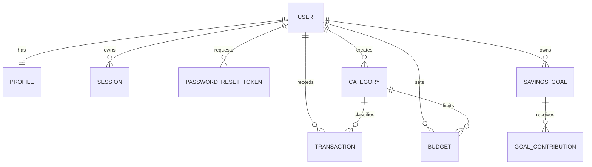

# BudgetWise — Phase 3: Database Design

## 1. Database design goals

The database must retain accurate, user-private financial records while supporting fast monthly summaries, category budgets, and savings-goal progress. PostgreSQL is the proposed relational database and Prisma is the proposed type-safe ORM.

Core rules:

- Each financial record belongs to exactly one user.
- Store money as integer minor units, never floating-point values.
- Store instants as UTC timestamps; apply the user profile timezone for reporting periods.
- Derive dashboard totals and budget progress from canonical transactions in the MVP.
- Prefer database constraints over application-only assumptions.

## 2. Entities

| Entity | Purpose |
| --- | --- |
| `User` | Authenticated account identity and password hash. |
| `Profile` | One-to-one display and reporting preferences, including currency and timezone. |
| `Session` | Revocable authenticated session record. |
| `PasswordResetToken` | Short-lived, single-use password-reset token record. |
| `Category` | System defaults and user-owned custom income or expense categories. |
| `Transaction` | Canonical income or expense entry. |
| `Budget` | Monthly spending limit for one expense category. |
| `SavingsGoal` | User-defined savings target. |
| `GoalContribution` | Immutable contribution recorded against a savings goal. |

## 3. Entity relationships



`Category.user_id` is nullable only for system-provided categories. A custom category belongs to one user. All user-facing queries combine the authenticated user ID with the requested record ID to preserve data isolation.

## 4. Logical table structures

### `users`

| Column | Type | Constraints | Notes |
| --- | --- | --- | --- |
| `id` | UUID | PK | Generated server-side. |
| `email` | varchar(320) | `NOT NULL`, unique | Normalised to lowercase before storage. |
| `display_name` | varchar(100) | `NOT NULL` | User-facing name. |
| `password_hash` | varchar(255) | `NOT NULL` | Adaptive one-way hash only. |
| `created_at` | timestamptz | `NOT NULL`, default now | Audit timestamp. |
| `updated_at` | timestamptz | `NOT NULL`, default now | Managed by application/ORM. |

### `profiles`

| Column | Type | Constraints | Notes |
| --- | --- | --- | --- |
| `id` | UUID | PK | Generated server-side. |
| `user_id` | UUID | `NOT NULL`, unique, FK → `users.id` | Enforces one profile per user. |
| `currency_code` | char(3) | `NOT NULL`, default `USD` | ISO 4217 code; whitelist validation in application. |
| `timezone` | varchar(64) | `NOT NULL`, default `UTC` | IANA timezone; validate in application. |
| `created_at` / `updated_at` | timestamptz | `NOT NULL` | Audit timestamps. |

### `categories`

| Column | Type | Constraints | Notes |
| --- | --- | --- | --- |
| `id` | UUID | PK | Generated server-side. |
| `user_id` | UUID | nullable, FK → `users.id` | Null means a system default category. |
| `name` | varchar(60) | `NOT NULL` | Trimmed, display label. |
| `kind` | enum | `NOT NULL` | `INCOME` or `EXPENSE`. |
| `is_archived` | boolean | `NOT NULL`, default false | Preserves historical transaction classification. |
| `created_at` / `updated_at` | timestamptz | `NOT NULL` | Audit timestamps. |

Unique rules:

- A user cannot have two custom categories of the same kind with the same case-insensitive name.
- System category names are unique within their kind.

### `transactions`

| Column | Type | Constraints | Notes |
| --- | --- | --- | --- |
| `id` | UUID | PK | Generated server-side. |
| `user_id` | UUID | `NOT NULL`, FK → `users.id` | Owner. |
| `category_id` | UUID | `NOT NULL`, FK → `categories.id` | Category must be permitted for this user and match transaction kind; enforce service-side. |
| `kind` | enum | `NOT NULL` | `INCOME` or `EXPENSE`. |
| `amount_minor` | bigint | `NOT NULL`, check `> 0` | Positive minor-unit amount. |
| `occurred_at` | timestamptz | `NOT NULL` | When income or expense occurred. |
| `note` | varchar(500) | nullable | Plain text only; never render as HTML. |
| `created_at` / `updated_at` | timestamptz | `NOT NULL` | Audit timestamps. |

The sign is represented by `kind`; `amount_minor` is always positive. This prevents ambiguity and makes checks/indexes simpler.

### `budgets`

| Column | Type | Constraints | Notes |
| --- | --- | --- | --- |
| `id` | UUID | PK | Generated server-side. |
| `user_id` | UUID | `NOT NULL`, FK → `users.id` | Owner. |
| `category_id` | UUID | `NOT NULL`, FK → `categories.id` | Must be an expense category accessible to owner. |
| `month_start` | date | `NOT NULL` | First calendar day of the reporting month in user timezone. |
| `limit_minor` | bigint | `NOT NULL`, check `> 0` | Budget ceiling in minor units. |
| `created_at` / `updated_at` | timestamptz | `NOT NULL` | Audit timestamps. |

Unique rule: one budget per `(user_id, category_id, month_start)`.

### `savings_goals`

| Column | Type | Constraints | Notes |
| --- | --- | --- | --- |
| `id` | UUID | PK | Generated server-side. |
| `user_id` | UUID | `NOT NULL`, FK → `users.id` | Owner. |
| `name` | varchar(100) | `NOT NULL` | Goal label. |
| `target_minor` | bigint | `NOT NULL`, check `> 0` | Target amount. |
| `target_date` | date | nullable | Optional motivational target date. |
| `status` | enum | `NOT NULL`, default `ACTIVE` | `ACTIVE`, `COMPLETED`, or `ARCHIVED`. |
| `created_at` / `updated_at` | timestamptz | `NOT NULL` | Audit timestamps. |

Goal progress is the sum of its contributions, not a mutable balance column. This prevents drift and preserves an audit trail.

### `goal_contributions`

| Column | Type | Constraints | Notes |
| --- | --- | --- | --- |
| `id` | UUID | PK | Generated server-side. |
| `goal_id` | UUID | `NOT NULL`, FK → `savings_goals.id` | Parent goal. |
| `amount_minor` | bigint | `NOT NULL`, check `> 0` | Positive minor-unit amount. |
| `contributed_at` | timestamptz | `NOT NULL` | When contribution was made. |
| `note` | varchar(500) | nullable | Optional plain-text note. |
| `created_at` | timestamptz | `NOT NULL` | Audit timestamp. |

Contributions are immutable after creation in the MVP. Mistakes are corrected by a compensating contribution or a future explicit adjustment feature, preserving an accurate audit history.

### Authentication-support tables

`sessions` stores a session token hash, `user_id`, expiry, creation time, and last-used time. `password_reset_tokens` stores a token hash, `user_id`, expiry, used timestamp, and creation time. Raw tokens are only delivered to the user and are never persisted or logged.

## 5. Referential actions and lifecycle rules

| Parent → child | Delete behaviour | Reason |
| --- | --- | --- |
| User → Profile, Sessions, PasswordResetTokens | Cascade | These have no purpose without the account. |
| User → Custom Categories, Transactions, Budgets, Goals | Restrict during normal operation | Prevents accidental loss of financial history. Account deletion must use a deliberate, audited deletion workflow. |
| Category → Transactions | Restrict | Categories with history are archived, not deleted. |
| Category → Budgets | Restrict | An active/historical budget must not silently lose its category. |
| SavingsGoal → GoalContributions | Restrict | Goals with history are archived, not deleted. |

## 6. Index strategy

| Table | Index | Purpose |
| --- | --- | --- |
| `users` | unique `email` | Fast sign-in lookup and duplicate prevention. |
| `profiles` | unique `user_id` | One-to-one profile lookups. |
| `sessions` | unique `token_hash`; `(user_id, expires_at)` | Session validation and user-wide revocation/cleanup. |
| `password_reset_tokens` | unique `token_hash`; `(user_id, expires_at)` | Reset verification and cleanup. |
| `categories` | `(user_id, kind, is_archived)` | Lists a user's active custom categories. |
| `transactions` | `(user_id, occurred_at DESC)` | Main history and reporting date range. |
| `transactions` | `(user_id, category_id, occurred_at DESC)` | Budget/category reporting. |
| `budgets` | unique `(user_id, category_id, month_start)` | One budget per category/month. |
| `budgets` | `(user_id, month_start)` | Monthly dashboard retrieval. |
| `savings_goals` | `(user_id, status)` | Active-goal list. |
| `goal_contributions` | `(goal_id, contributed_at DESC)` | Goal progress and contribution history. |

Indexes should be verified with realistic data and query plans after implementation; avoid adding indexes that are not used.

## 7. Proposed Prisma schema

This schema is a design artifact for Phase 3. It will be added to the application only during project initialisation after the selected Prisma version and authentication adapter are confirmed.

```prisma
generator client {
  provider = "prisma-client-js"
}

datasource db {
  provider = "postgresql"
  url      = env("DATABASE_URL")
}

enum TransactionKind { INCOME EXPENSE }
enum GoalStatus { ACTIVE COMPLETED ARCHIVED }

model User {
  id                  String               @id @default(uuid()) @db.Uuid
  email               String               @unique @db.VarChar(320)
  displayName         String               @db.VarChar(100)
  passwordHash        String               @db.VarChar(255)
  createdAt           DateTime             @default(now())
  updatedAt           DateTime             @updatedAt
  profile             Profile?
  sessions            Session[]
  passwordResetTokens PasswordResetToken[]
  categories          Category[]
  transactions        Transaction[]
  budgets             Budget[]
  savingsGoals        SavingsGoal[]
}

model Profile {
  id           String   @id @default(uuid()) @db.Uuid
  userId       String   @unique @db.Uuid
  currencyCode String   @default("USD") @db.Char(3)
  timezone     String   @default("UTC") @db.VarChar(64)
  createdAt    DateTime @default(now())
  updatedAt    DateTime @updatedAt
  user         User     @relation(fields: [userId], references: [id], onDelete: Cascade)
}

model Category {
  id          String          @id @default(uuid()) @db.Uuid
  userId      String?         @db.Uuid
  name        String          @db.VarChar(60)
  kind        TransactionKind
  isArchived  Boolean         @default(false)
  createdAt   DateTime        @default(now())
  updatedAt   DateTime        @updatedAt
  user        User?           @relation(fields: [userId], references: [id], onDelete: Restrict)
  transactions Transaction[]
  budgets     Budget[]

  @@index([userId, kind, isArchived])
}

model Transaction {
  id          String          @id @default(uuid()) @db.Uuid
  userId      String          @db.Uuid
  categoryId  String          @db.Uuid
  kind        TransactionKind
  amountMinor BigInt
  occurredAt  DateTime
  note        String?         @db.VarChar(500)
  createdAt   DateTime        @default(now())
  updatedAt   DateTime        @updatedAt
  user        User            @relation(fields: [userId], references: [id], onDelete: Restrict)
  category    Category        @relation(fields: [categoryId], references: [id], onDelete: Restrict)

  @@index([userId, occurredAt(sort: Desc)])
  @@index([userId, categoryId, occurredAt(sort: Desc)])
}

model Budget {
  id          String   @id @default(uuid()) @db.Uuid
  userId      String   @db.Uuid
  categoryId  String   @db.Uuid
  monthStart  DateTime @db.Date
  limitMinor  BigInt
  createdAt   DateTime @default(now())
  updatedAt   DateTime @updatedAt
  user        User     @relation(fields: [userId], references: [id], onDelete: Restrict)
  category    Category @relation(fields: [categoryId], references: [id], onDelete: Restrict)

  @@unique([userId, categoryId, monthStart])
  @@index([userId, monthStart])
}

model SavingsGoal {
  id            String             @id @default(uuid()) @db.Uuid
  userId        String             @db.Uuid
  name          String             @db.VarChar(100)
  targetMinor   BigInt
  targetDate    DateTime?          @db.Date
  status        GoalStatus         @default(ACTIVE)
  createdAt     DateTime           @default(now())
  updatedAt     DateTime           @updatedAt
  user          User               @relation(fields: [userId], references: [id], onDelete: Restrict)
  contributions GoalContribution[]

  @@index([userId, status])
}

model GoalContribution {
  id              String      @id @default(uuid()) @db.Uuid
  goalId          String      @db.Uuid
  amountMinor     BigInt
  contributedAt   DateTime
  note            String?     @db.VarChar(500)
  createdAt       DateTime    @default(now())
  goal            SavingsGoal @relation(fields: [goalId], references: [id], onDelete: Restrict)

  @@index([goalId, contributedAt(sort: Desc)])
}

model Session {
  id         String   @id @default(uuid()) @db.Uuid
  userId     String   @db.Uuid
  tokenHash  String   @unique @db.VarChar(255)
  expiresAt  DateTime
  createdAt  DateTime @default(now())
  lastUsedAt DateTime @default(now())
  user       User     @relation(fields: [userId], references: [id], onDelete: Cascade)

  @@index([userId, expiresAt])
}

model PasswordResetToken {
  id        String   @id @default(uuid()) @db.Uuid
  userId    String   @db.Uuid
  tokenHash String   @unique @db.VarChar(255)
  expiresAt DateTime
  usedAt    DateTime?
  createdAt DateTime @default(now())
  user      User     @relation(fields: [userId], references: [id], onDelete: Cascade)

  @@index([userId, expiresAt])
}
```

### Prisma and database caveats

Prisma schema declarations cannot express every PostgreSQL rule. Phase 4 migrations must add check constraints for positive monetary fields, partial unique indexes for case-insensitive category names, and any database-level category/transaction-kind enforcement that is practical. Services must also verify that a category is either system-owned or belongs to the authenticated user.

## 8. Seed data strategy

Seed only development/demo data, never production financial records. The seed should be idempotent and contain:

1. System categories for income (for example, Salary, Scholarship, Gift) and expenses (Housing, Groceries, Transport, Education, Utilities, Health, Entertainment, Other).
2. One clearly marked demo user created only in local development with a password supplied by an environment variable or generated at run time.
3. A small realistic three-month transaction set, one budget per common expense category, and two savings goals.

The seed script must use safe placeholder data, print no credentials, and refuse to run against a production environment.

## 9. Data integrity tests for later phases

- Reject zero, negative, fractional, or out-of-range monetary values at the API and database layers.
- Verify one user cannot query or mutate another user's transactions, budgets, goals, or custom categories.
- Verify a transaction cannot use an incompatible category kind.
- Verify duplicate budgets for the same user/category/month are rejected.
- Verify archived categories remain visible on historical transactions but cannot be selected for new ones.
- Verify a goal's displayed progress equals the sum of its contributions after concurrent requests and failures.
- Verify account deletion follows the documented deliberate workflow and cannot occur through a normal record deletion route.
